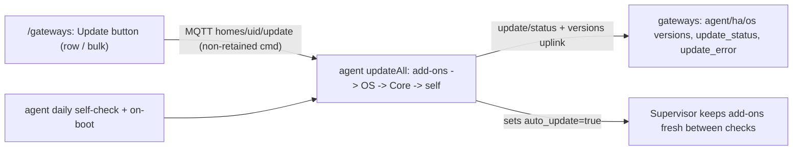

# Fleet update

Every claimed gateway runs the **latest** of everything: the agent add-on, HA
Core, HAOS, and the add-ons we depend on (Mosquitto, Zigbee2MQTT, Matter). There
is no pinning, no per-gateway target version, and no release authority — the
fleet is kept fresh by two forces working together:

- **HA-native `auto_update`.** The agent turns on Supervisor's own
  `auto_update: true` for every add-on it manages, so HA keeps them current
  between checks with zero cloud involvement.
- **The agent's `updateAll` engine.** HAOS and Core never self-update, and an
  add-on may still lag, so the agent drives the Supervisor update endpoints
  itself: on a daily self-check (and at boot), and on an on-demand **Update**
  command from the fleet page.

A command that misses an offline gateway is fine by design: the next daily
self-check converges it anyway. That is why there is **no retained doc, no
sequence counter, and no reconcile sweep** — nothing to catch up on.

## `updateAll` — the one engine

`internal/agent/update.go` runs one idempotent pass that brings the unit to the
latest, in a deliberate order so a self-restart never strands an in-progress
update:

1. **Add-ons** — for each managed add-on (from the bootstrap set in
   `fleet/release.json`): install if missing, update to latest if outdated, and
   set `auto_update: true`.
2. **HAOS** — apply the OS update if one is available (reboots the unit).
3. **Core** — apply the Core update if one is available.
4. **Agent self** — update the agent's own add-on **last**, because a self-update
   restarts the process.

Each already-current phase is a no-op, so re-running the pass is cheap and safe.

### Resume safety

At the start of a pass the agent writes a small `/data/update-in-progress.json`
marker (`in_progress` + the triggering `update_id`) — before any reboot-prone
phase. On boot, if the marker is present, the agent re-runs the whole pass:
because each already-current phase is a no-op, it effectively continues at the
first phase that still has work, then clears the marker once everything is
current (a hard failure also clears it — the retry is the next command or daily
tick, not a boot loop). The marker deliberately does **not** record "which phase
came next"; re-running the idempotent pass is simpler and self-correcting. This
replaces the old `applied-release.json` / `release_seq` machinery.

### Status reporting

The agent publishes `homes/{uid}/update/status`:

- **`started`** when it begins a *commanded* run (carries the command's
  `update_id`).
- **`ok`** when everything is on the latest.
- **`failed`** + an `error` string on any hard failure.

The daily self-check runs silently with **no** `update_id` (it still reports
`ok`/`failed`). The cloud reflects the latest report onto
`gateways.update_status` / `update_error` / `update_completed_at`, so a stuck or
failed update is visible on `/gateways` and retryable by re-sending the command
(or by the next daily tick). `versions` is republished on connect and after each
update so the cloud always shows what is actually running.

## Where an update is triggered

- **Fleet page (`/gateways`).** An **Update** action per row and a bulk "update
  matching" action publish the non-retained `homes/{uid}/update` command
  (`PublishGatewayUpdate` in the cloud repo). This is the on-demand path for
  HAOS/Core, which do not auto-update.
- **The agent itself.** On claimed-mode start and every ~24h (jittered per
  device so the fleet does not stampede), the agent runs `updateAll` on its own.

## The CLI bootstrap set (`fleet/release.json`)

The `smart-onboard` CLI reads a **version-free bootstrap add-on set** from
[`../smart-home-agent/fleet/release.json`](../smart-home-agent/fleet/release.json)
(embedded at build; override with `--manifest`). It lists only the add-on store
repository and the add-ons to install at **latest** — no versions. The CLI's job
ends at "the unit can start the agent and enroll"; from then on `updateAll` +
`auto_update` keep everything current. The file name is historical; it carries no
release identity anymore.

## Publishing a new agent build

1. Bump `version:` in
   [`../smart-home-agent/config.yaml`](../smart-home-agent/config.yaml), commit,
   push a `vX.Y.Z` tag. The GitHub Actions workflow
   ([`.github/workflows/build.yaml`](../.github/workflows/build.yaml)) builds the
   multi-arch image and pushes it to the **public** GHCR package
   `ghcr.io/prameg/smart-home-edge/{arch}-smart_home_agent` (gateways pull
   anonymously). The tag is the `BUILD_VERSION` build-arg so the agent's version
   stamp matches `config.yaml`.
2. That's it. Field units pick it up via `auto_update` (or the next daily
   self-check / an on-demand fleet **Update**). There is no release to author and
   nothing to assign.

## Rationale

- **Latest-everywhere removes a whole control plane.** No release table, no
  lifecycle, no pinning, no rollout status, no reconcile sweep — the failure
  modes those introduced (drift between two release definitions, stuck rollouts,
  seq-counter bugs) simply don't exist.
- **Autonomous by default, visible when it fails.** A unit converges without a
  human via the daily check; a failed update surfaces on `/gateways` and is
  retried by re-sending the command or the next tick.
- **Offline autonomy still depends on local components.** Zigbee2MQTT + local
  Mosquitto + Matter run the home when the WAN is down; they are part of the
  managed add-on set `updateAll` keeps current.
- **Rollback is HA's job, not ours.** If a bad version ships, use HA's own
  add-on/OS rollback or re-flash. We deliberately do not build canary/rollback
  tooling — if certified version sets ever become a real requirement, that is a
  new feature, not a revival of the release control plane.

See [`gateway-lifecycle.md`](gateway-lifecycle.md) for the full lifecycle
vocabulary and [`golden-image.md`](golden-image.md) for the flash → boot → claim
onboarding path.
