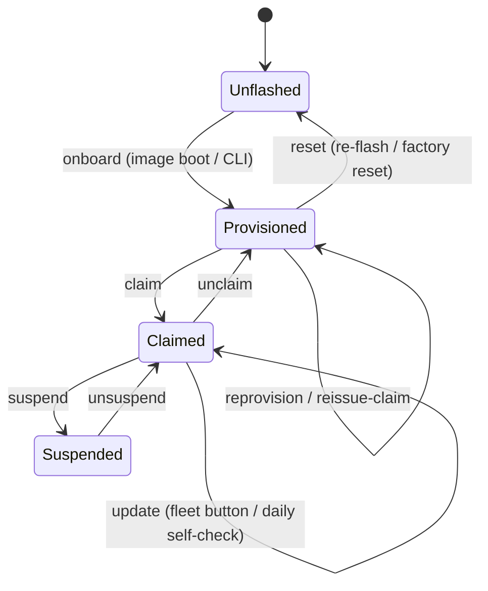

# Gateway lifecycle

One vocabulary for everything that happens to a gateway, from an unflashed board
to a claimed, up-to-date unit in a home — and where each action lives (the
`smart-onboard` CLI, the admin **/gateways** fleet page, or the on-device Ingress
panel). Use these verbs consistently across code, UI, and docs.

## The verbs

### onboard
Bring an unflashed board to a **provisioned** state (enrolled, running the agent,
surfacing a claim code). Two paths to the same end state:

- **Golden image (primary)** — flash → boot → claim; the agent is pre-installed
  and enrolls itself on first boot. See [`golden-image.md`](golden-image.md).
- **`smart-onboard` CLI (fallback)** — drives a stock-HAOS unit through owner
  creation, the bootstrap add-on install, agent config, start, and reads back the
  claim code. See [`factory-onboarding.md`](factory-onboarding.md).

Onboarding does **not** pin versions — it installs the bootstrap add-on set at
latest. Version convergence is the cloud's job after claim.

### claim
Bind a **provisioned** (unclaimed) gateway to a home. User-facing, in the Smart
Home app: enter the short `XXXX-XXXX` claim code. On success the cloud publishes
the retained `config` doc (`claimed: true`), so the unit flips into claimed mode
with no admin action. A just-claimed unit already runs the latest (onboarding
installs everything at latest and the agent enables `auto_update`); its first
daily self-check keeps HAOS/Core current from there.

### update
Bring a **claimed** gateway to the **latest** of everything (add-ons → HAOS →
Core → agent self). There is no pinning and no target version — the agent's
`updateAll` engine always converges to latest. Two triggers:

- **Daily self-check** — the agent runs `updateAll` on claimed-mode start and
  every ~24h on its own; add-ons also stay fresh via HA-native `auto_update`.
- **Fleet Update** — an on-demand per-row or bulk **Update** button on
  **/gateways** publishes the non-retained `homes/{uid}/update` command (mainly
  for HAOS/Core, which never auto-update).

Progress is reported on `update/status` and reflected as `update_status`
(`updating → ok`, or `failed` with an error) on the fleet page. A missed command
on an offline unit needs no catch-up — the next daily check converges it (see
[`fleet-update.md`](fleet-update.md)).

### unclaim
Unbind a **claimed** gateway from its home (home deleted or re-homing a unit).
The cloud clears the retained `config`, per-device `shadow/desired`, and
`inventory` so the unit inherits nothing from the previous home, and the agent
drops back to availability-only (unclaimed) mode. The unit stays provisioned and
can be claimed again.

### reprovision
Rotate a gateway's MQTT credentials while keeping the same `uid` and home/claim
binding. **Automatic** in the normal case: the agent re-provisions itself with
its stored provision token when the broker rejects its password. Manual triggers
exist on the Ingress panel and, for a token-lost unit, via an admin-opened
**re-enrollment window** on the fleet page (the factory key then re-enrolls that
known serial once). MQTT-transport reprovision is intentionally **not** offered —
when creds are truly broken the broker is unreachable, so the fix can't ride
MQTT; HTTP provisioning is the recovery channel.

### reissue-claim
Mint a fresh claim code for a still-unclaimed unit **without** touching MQTT
credentials (the old code expired, or an unclaim cleared it). The agent does this
automatically at boot while unclaimed; the Ingress panel exposes it manually.

### suspend / unsuspend
Administratively pause a claimed gateway from the fleet page without unclaiming
it. A suspended unit keeps its identity and home binding but is excluded from
fleet updates (a bulk **Update** skips it). Unsuspend returns it to normal
operation.

### reset
Return a unit to **unflashed**: re-flash the golden image or factory-reset HAOS.
A `/data` wipe removes `agent-creds.json`; the unit re-enrolls automatically on
next boot under its hardware-derived `uid` (it does not lose its cloud identity —
same serial, same `uid`). Re-flashing then re-onboards it via the golden-image or
CLI path.

## Where each action lives

- **`smart-onboard` CLI** — onboard (fallback path).
- **Golden image** — onboard (primary path): flash → boot → claim.
- **Smart Home app** — claim.
- **Admin /gateways fleet page** — update (per-row + bulk), unclaim, suspend/
  unsuspend, open a re-enrollment window, view `update_status` (including
  `failed`) and the running agent/HA/OS versions.
- **On-device Ingress panel** — reprovision, reissue-claim, and local status for
  a technician standing at the unit.

## Fallback & recovery quick map

- **Cloud unreachable at first boot** — agent enroll retry loop (2s → 5m
  backoff); no action needed.
- **MQTT creds broken** — agent auto-reprovisions via provision token; Ingress
  panel has a manual trigger.
- **Update stuck/failed** — surfaces as `failed` on /gateways; recovery is
  re-sending the **Update** command or waiting for the next daily self-check.
- **Rollback** — HA's own add-on/OS rollback, or re-flash; there is no
  version-pinning to roll back to.
- **Bad/bricked unit** — reset (re-flash) → onboard → claim; it converges to
  latest on its own.
- **Claim code lost/expired** — agent auto-reissues at boot; Ingress panel
  reissue.
